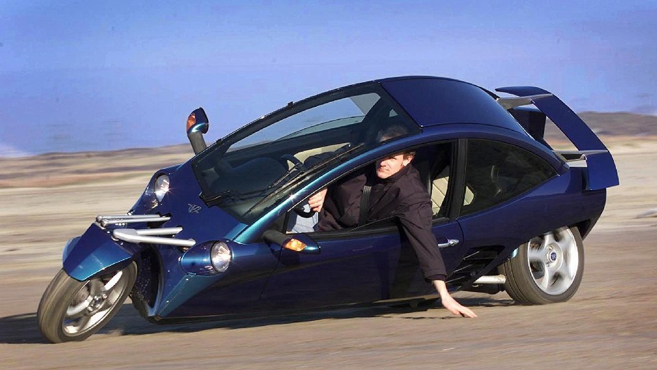

# Image Classifier with Hugging Face & fastai

This script demonstrates how to train an image classification model using local datasets with Hugging Face and fastai.

## 📚 Resources

This project come from the Fast.ai course:

Lesson 1: Creating a Model from Your Own Data:
    https://course.fast.ai/Lessons/lesson1.html


## Is it a car… or not? 🤔
Sometimes you look at a picture and ask yourself: 
"Hmm… is that a car ?" 🚗🏍️  
Let's find out!




## Project Structure
```CSS
.
├── data
│   ├── car
│   │   ├── img_0.jpg
│   │   ├── ...
│   └── bike
│       ├── img_0.jpg
│       ├── ...
├── main.py
├── pyproject.toml
├── README.md
└── test_images
    └── eg_img.jpg
```

## Results
After training, the model achieves:

```css
epoch     train_loss  valid_loss  error_rate  time
0         0.921707    0.085875    0.041667    00:05
1         0.339507    0.204725    0.083333    00:07
2         0.257844    0.117755    0.020833    00:07
This is a: car.                                                          
Probability it's a car: 0.___
```

- train_loss → how well the model is fitting the training data (lower is better).

- valid_loss → how well it generalizes to unseen validation data (lower is better).

- error_rate → percentage of misclassified images (0.020833 = ~2%).

- time → time taken per epoch.

## Observations

Training loss decreases steadily → model is learning.

Validation loss also decreases → model is generalizing well.

Error rate is very low (~2%) → excellent accuracy for a small dataset.

## Notes

- The model is trained using local data.
- Fastai's DataBlock API is utilized for data processing and augmentation.
- The model is compatible with Hugging Face's ImageClassificationPipeline for inference.